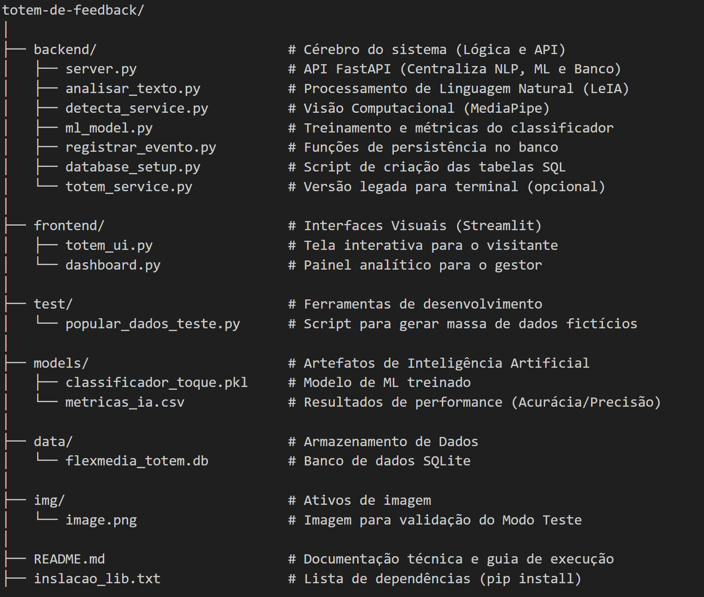

# Totem de Feedback Inteligente

A Flexmedia busca transformar espaços físicos em ambientes inteligentes, utilizando IA e sensores para medir engajamento e oferecer experiências personalizadas.

## 🚩 O Problema
A dificuldade de coletar e analisar o sentimento dos visitantes de forma automática e em tempo real em espaços culturais ou comerciais.

## 💡 A Solução
Um Totem Inteligente que utiliza Processamento de Linguagem Natural (NLP) e Visão Computacional para interpretar feedbacks, classificar emoções e gerar dashboards analíticos para a gestão do espaço. O projeto evoluiu para uma **Arquitetura Cliente-Servidor (API REST)**, garantindo escalabilidade e separação de responsabilidades.

### 🛠 Tecnologias Utilizadas
Para garantir a viabilidade técnica e a integração exigida, as seguintes tecnologias foram selecionadas:

* **Linguagem:** Python 3.11
* **Backend / API:** FastAPI e Uvicorn (Para roteamento e comunicação cliente-servidor).
* **Interface / Frontend:** Streamlit e Plotly Express (Para o Dashboard e a Tela do Totem).
* **Visão Computacional:** MediaPipe (Google) e OpenCV para detecção facial de alta precisão.
* **Inteligência Artificial (NLP):** LeIA (VADER adaptado para Português) para análise de sentimento.
* **IA / Machine Learning:** Scikit-Learn (Decision Tree Classifier) e Pandas.
* **Banco de Dados:** SQLite (Armazenamento estruturado local e portabilidade).

### 🏗 Arquitetura da Solução
A arquitetura segue um modelo Cliente-Servidor com um pipeline de dados linear e eficiente:

1. **Captura (Visão):** O `detecta_service.py` no servidor utiliza a câmera para validar se há um visitante presente.
2. **Interação (Frontend):** O `totem_ui.py` exibe a tela e envia os dados coletados para a API REST.
3. **Processamento (ML/NLP):** A API processa a duração do toque (via classificador IA) e analisa o texto do feedback (NLP).
4. **Resposta:** O servidor gera uma mensagem automática baseada no sentimento e a devolve para o totem exibir na tela.
5. **Persistência:** Todos os dados (texto limpo e métricas) são salvos no banco SQLite.
6. **Analytics (Dashboard):** O `dashboard.py` consome os dados do banco para gerar insights de engajamento e correlações para o gestor.

### 📊 Estratégia de Coleta de Dados
A coleta será baseada em eventos de interação.
* **Dados Iniciais:** Possuímos um script dedicado de simulação (`popular_dados_teste.py`) para validar a arquitetura e popular gráficos.
* **Métricas:** O sistema registra o horário da visita, a nota de satisfação (1-5), o conteúdo textual do feedback e o tipo de interação (Toque Curto/Longo).

### 🔒 Segurança e Privacidade (LGPD)
Alinhado com as diretrizes da Flexmedia, o projeto adota:
* **Anonimização:** Imagens da câmera são processadas em tempo real *apenas* para detecção de presença e **não são armazenadas** no disco.
* **Integridade:** Validação de entradas no servidor para evitar registros corrompidos ou injeções de código.

### 🧠 Lógica de Machine Learning
O modelo utiliza a Duração do Toque como feature para classificar a interação em dois tipos:
* **Toque Curto:** Geralmente associado a seleções rápidas.
* **Toque Longo:** Pode indicar dúvida ou uma interação específica configurada no totem.

### 📂 Estrutura do Projeto

### ⚙️ Como Executar o Projeto

**Instalar Dependências:** python -m pip install -r instalacao_lib.txt

**Inicializar o Banco de Dados:** python src/backend/database_setup.py

**Treinar a Inteligência Artificial:** python src/backend/ml_model.py

**Iniciar o Servidor Backend (API):** python -m uvicorn backend.server:app --reload

### Iniciar as Interfaces (Abra um NOVO terminal):

**Iniciar o Dashboard:** streamlit run src/frontend/dashboard.py

**Iniciar o Tela:** streamlit run src/frontend/totem_ui.py

### (Opcional) Popular o banco com dados de teste:

**Rode o teste:** python src/test/popular_dados_teste.py

_As telas do Streamlit abrirão automaticamente no seu navegador padrão (geralmente em http://localhost:8501 e http://localhost:8502)._
